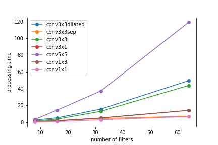

# Benchmarking different convolutions
Evaluating efficiency of several types of convolutions.

[Keras implementation](conv_keras.ipynb)

[PyTorch implementation](conv_pytorch.ipynb)

## Results

### Keras CPU

||conv1x1|conv3x1|conv1x3|conv3x3sep|conv3x3|conv5x5|
|:-:|:-:|:-:|:-:|:-:|:-:|:-:|
|processing time [sec]|6.693|14.083|14.022|7.197|43.729|118.820|
|vs 3x3|0.153|0.322|0.321|0.165|1.000|2.717|
|theoretical complexity|0.111|0.333|0.333|0.016|1.000|2.778|

### Keras GPU

convs = ["conv1x1", "conv3x1", "conv1x3", "conv3x3sep", "conv3x3", "conv5x5", "conv3x3dilated"]

||conv1x1|conv3x1|conv1x3|conv3x3sep|conv3x3|conv5x5|conv3x3dilated|
|:-:|:-:|:-:|:-:|:-:|:-:|:-:|
|processing time [sec]|1.248|1.422|1.515|1.490|1.594|2.851|2.088|
|vs 3x3|0.783|0.892|0.951|0.935|1.000|1.789|1.310|
|theoretical complexity|0.111|0.333|0.333|0.016|1.000|2.778|1.000|

### PyTorch CPU

||conv1x1|conv3x1|conv1x3|conv3x3sep|conv3x3|conv5x5|
|:-:|:-:|:-:|:-:|:-:|:-:|:-:|
|processing time [sec]|6.920|17.099|17.088|16.628|48.608|133.599|
|vs 3x3|0.142|0.352|0.352|0.342|1.000|2.748|
|theoretical complexity|0.111|0.333|0.333|0.016|1.000|2.778|

### PyTorch GPU

||conv1x1|conv3x1|conv1x3|conv3x3sep|conv3x3|conv5x5|
|:-:|:-:|:-:|:-:|:-:|:-:|:-:|
|processing time [sec]|0.102|0.173|0.169|3.786|0.230|1.108|
|vs 3x3|0.441|0.750|0.733|16.447|1.000|4.816|
|theoretical complexity|0.111|0.333|0.333|0.016|1.000|2.778|

`cudnn.benchmark = True`

||conv1x1|conv3x1|conv1x3|conv3x3sep|conv3x3|conv5x5|
|:-:|:-:|:-:|:-:|:-:|:-:|:-:|
|processing time [sec]|0.096|0.173|0.169|1.716|0.229|0.984|
|vs 3x3|0.418|0.753|0.735|7.485|1.000|4.291|
|theoretical complexity|0.111|0.333|0.333|0.016|1.000|2.778|

`cudnn.benchmark = True`, `cudnn.fastest = True`

||conv1x1|conv3x1|conv1x3|conv3x3sep|conv3x3|conv5x5|
|:-:|:-:|:-:|:-:|:-:|:-:|:-:|
|processing time [sec]|0.096|0.173|0.169|1.717|0.230|0.985|
|vs 3x3|0.416|0.752|0.733|7.460|1.000|4.280|
|theoretical complexity|0.111|0.333|0.333|0.016|1.000|2.778|

## References

C. Szegedy, V. Vanhoucke, S. Ioffe, J. Shlens, Z. Wojna, "Rethinking the Inception Architecture for Computer Vision," in Proc. of CVPR, 2016.

A. G. Howard, M. Zhu, B. Chen, D. Kalenichenko, W. Wang, T. Weyand, M. Andreetto, and H. Adam, "MobileNets: Efficient Convolutional Neural Networks for Mobile Vision Applications," in arXiv:1704.04861, 2017.

F. Chollet, "Xception: Deep Learning with Depthwise Separable Convolutions," in Proc. of CVPR, 2017.
